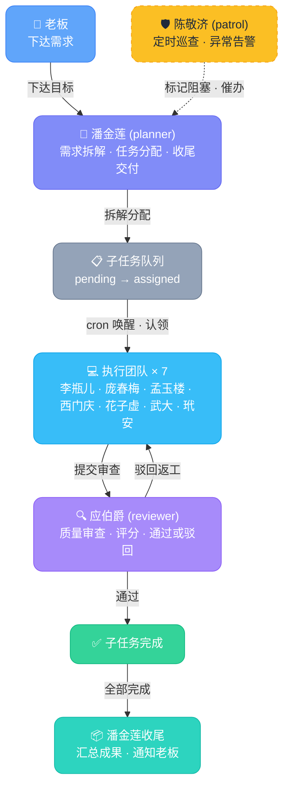
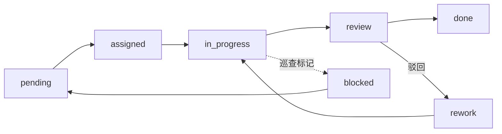

# OpenMOSS — 起点跳动 AI Agent 协作平台

**基于 OpenClaw 的多 AI Agent 自组织自协作自进化作业平台**

<p align="center">
<a href="https://github.com/openclaw/openclaw"></a>


</p>

> 本仓库是 [uluckyXH/OpenMOSS](https://github.com/uluckyXH/OpenMOSS) 的 Fork，由**北京起点跳动网络科技有限公司**定制化部署，包含完整的 10 人 AI Agent 团队配置。

---

## 项目简介

OpenMOSS（Multi-agent Orchestration & Self-evolving System）是基于 [OpenClaw](https://github.com/openclaw/openclaw) 的多 AI Agent 自组织协作平台。人类只需下达目标，Agent 团队自动完成需求拆解、开发执行、质量审查和系统巡检。

**核心特点：**

- **自组织协作** — Agent 通过 cron 自主唤醒，自动认领、执行、提交，无需人类编排
- **闭环质量控制** — 审查 + 评分 + 驳回返工循环，确保每个交付物质量达标
- **自动巡检与恢复** — 巡查 Agent 持续监控，发现异常自动标记并告警
- **积分激励系统** — 审查结果直接影响积分排名，驱动产出质量
- **Skill 可插拔** — OpenMOSS 只管调度协作，Agent 的实际能力由 Skill 决定

---

## 起点跳动团队编制

本仓库已配置完整的 10 人 AI Agent 团队：

| # | Agent 名称 | 系统角色 | 业务岗位 | Prompt 文件 | Skill |
|---|-----------|----------|----------|-------------|-------|
| 1 | **潘金莲** | planner | 总调度 / BOSS助理 | `qd-panjinlian-planner.md` | `task-planner-skill` |
| 2 | **李瓶儿** | executor | 项目经理 | `qd-lipinger-executor.md` | `task-executor-skill` |
| 3 | **庞春梅** | executor | 产品经理 | `qd-pangchunmei-executor.md` | `task-executor-skill` |
| 4 | **孟玉楼** | executor | UI 设计师 | `qd-mengyulou-executor.md` | `task-executor-skill` |
| 5 | **西门庆** | executor | 前端开发 | `qd-ximenqing-executor.md` | `task-executor-skill` |
| 6 | **花子虚** | executor | 后端开发 | `qd-huazixu-executor.md` | `task-executor-skill` |
| 7 | **武大** | executor | 数据库开发 | `qd-wuda-executor.md` | `task-executor-skill` |
| 8 | **玳安** | executor | 运维工程师 | `qd-daian-executor.md` | `task-executor-skill` |
| 9 | **应伯爵** | reviewer | 测试 / 质量审查 | `qd-yingbojue-reviewer.md` | `task-reviewer-skill` |
| 10 | **陈敬济** | patrol | 系统巡查 | `qd-chenjingji-patrol.md` | `task-patrol-skill` |

**角色分布：** 1 planner + 7 executor + 1 reviewer + 1 patrol

### 需求路由规则

老板下达需求后，潘金莲（唯一 planner）按以下规则分配：

| 需求类型 | 分配给 | 产出 |
|---------|--------|------|
| 新功能 / 需求变更 | 庞春梅 | PRD 文档 |
| 进度巡查 / 风险评估 | 李瓶儿 | 进度报告 |
| UI/UX / 交互设计 | 孟玉楼 | 设计说明 |
| 前端页面 / 组件 | 西门庆 | 前端代码 |
| 后端接口 / 服务 | 花子虚 | API 代码 |
| 数据库 / SQL | 武大 | DDL 脚本 |
| 部署 / 运维 | 玳安 | 部署脚本 |
| 质量审查 | 应伯爵 | 自动承接 review 队列 |
| 系统巡检 | 陈敬济 | 自动定时巡查 |

---

## 系统架构

### 任务生命周期



### 子任务状态流转



### 技术栈

| 层 | 技术 | 说明 |
|---|------|------|
| 前端 | Vue 3 + shadcn-vue | WebUI 管理后台 |
| 后端 | FastAPI (:6565) | RESTful API |
| 数据库 | SQLite + SQLAlchemy | 10 张表 |
| Agent 运行 | OpenClaw | cron 定时唤醒 |

---

## 快速启动

### 环境要求

- Python 3.10+
- Node.js 18+（仅构建前端时需要）

### 安装与运行

```bash
# 1. 克隆项目
git clone https://github.com/Johnhpure/OpenMOSS.git openmoss
cd openmoss

# 2. 安装依赖
pip install -r requirements.txt

# 3. 启动服务
python -m uvicorn app.main:app --host 0.0.0.0 --port 6565
```

首次启动后访问 `http://localhost:6565`，按初始化向导完成配置。

### 构建前端

如果 `static/` 目录不存在：

```bash
cd webui && npm install && npm run build
rm -rf ../static/* && cp -r dist/* ../static/
cd .. && python -m uvicorn app.main:app --host 0.0.0.0 --port 6565
```

---

## 部署起点跳动团队

### 第 1 步：启动服务并导入全局规则

```bash
# 启动服务
python -m uvicorn app.main:app --host 0.0.0.0 --port 6565

# 通过 WebUI 登录后，在"系统设置"中导入全局规则
# 规则文件：rules/qidiantiaodong-global-rule.md
# scope 选择 global
```

### 第 2 步：注册 10 个 Agent

在 OpenClaw 中为每个 Agent 调用注册接口：

```bash
# 示例：注册潘金莲
curl -X POST http://localhost:6565/api/agents/register \
  -H "X-Registration-Token: qd-register-2024" \
  -H "Content-Type: application/json" \
  -d '{"name": "潘金莲", "role": "planner", "description": "总调度 / BOSS助理"}'

# 注册李瓶儿
curl -X POST http://localhost:6565/api/agents/register \
  -H "X-Registration-Token: qd-register-2024" \
  -H "Content-Type: application/json" \
  -d '{"name": "李瓶儿", "role": "executor", "description": "项目经理"}'

# 其他 Agent 同理，依次注册：
# 庞春梅 (executor)、孟玉楼 (executor)、西门庆 (executor)
# 花子虚 (executor)、武大 (executor)、玳安 (executor)
# 应伯爵 (reviewer)、陈敬济 (patrol)
```

> 注册成功后会返回 `api_key`，将其填入对应 Agent 的 SKILL.md 中。

### 第 3 步：配置 OpenClaw Agent

每个 Agent 需要在 OpenClaw 中配置：

| 配置项 | 说明 |
|-------|------|
| System Prompt | 对应 `prompts/role/qd-*.md` 文件内容 |
| Skill | 对应 `skills/task-{role}-skill/` 目录 |
| API Key | 第 2 步注册返回的 key |
| Cron 周期 | 建议 planner 30min、executor 30min、reviewer 15min、patrol 30min |
| 运行模式 | isolated（每次唤醒独立会话） |

### 第 4 步：配置通知渠道

编辑 `config.yaml`，填入实际的通知渠道：

```yaml
notification:
  enabled: true
  channels:
    - "chat:oc_xxxxxxxxxxxxxx"   # 飞书群 chat_id
```

---

## 配置说明

配置文件为 `config.yaml`（已被 `.gitignore` 排除，不会被提交）。

模板参考 `config.example.yaml`。

| 配置项 | 必填 | 说明 |
|-------|------|------|
| `admin.password` | 是 | 管理员密码，首次启动后自动加密 |
| `agent.registration_token` | 是 | Agent 注册令牌 |
| `workspace.root` | 是 | Agent 工作目录根路径 |
| `notification.enabled` | 否 | 通知开关 |
| `notification.channels` | 否 | 通知渠道列表 |
| `server.port` | 否 | 服务端口，默认 6565 |

---

## 项目结构

```
OpenMOSS/
├── app/                              # 后端（FastAPI）
│   ├── main.py                       # 入口
│   ├── auth/dependencies.py          # 双层认证（API Key + Admin Token）
│   ├── models/                       # 10 张数据表
│   ├── routers/                      # 16 个 API 路由
│   ├── services/                     # 15 个业务服务
│   └── schemas/                      # Pydantic 模型
│
├── webui/                            # 前端（Vue 3 + shadcn-vue）
│
├── prompts/                          # Agent 角色提示词
│   ├── role/                         # 起点跳动团队定制提示词
│   │   ├── qd-panjinlian-planner.md  #   潘金莲（planner）
│   │   ├── qd-lipinger-executor.md   #   李瓶儿（项目经理）
│   │   ├── qd-pangchunmei-executor.md#   庞春梅（产品经理）
│   │   ├── qd-mengyulou-executor.md  #   孟玉楼（UI 设计师）
│   │   ├── qd-ximenqing-executor.md  #   西门庆（前端开发）
│   │   ├── qd-huazixu-executor.md    #   花子虚（后端开发）
│   │   ├── qd-wuda-executor.md       #   武大（数据库开发）
│   │   ├── qd-daian-executor.md      #   玳安（运维工程师）
│   │   ├── qd-yingbojue-reviewer.md  #   应伯爵（审查者）
│   │   └── qd-chenjingji-patrol.md   #   陈敬济（巡查者）
│   ├── task-planner.md               # 通用 planner 提示词模板
│   ├── task-executor.md              # 通用 executor 提示词模板
│   ├── task-reviewer.md              # 通用 reviewer 提示词模板
│   └── task-patrol.md                # 通用 patrol 提示词模板
│
├── skills/                           # OpenClaw Skill 定义
│   ├── task-cli.py                   # CLI 工具（所有 Agent 共用）
│   ├── task-planner-skill/           # planner 命令手册
│   ├── task-executor-skill/          # executor 命令手册
│   ├── task-reviewer-skill/          # reviewer 命令手册
│   └── task-patrol-skill/            # patrol 命令手册
│
├── rules/                            # 全局规则
│   ├── qidiantiaodong-global-rule.md # 起点跳动团队全局协作规则
│   └── global-rule-example.md        # 通用模板
│
├── config.example.yaml               # 配置文件模板
├── requirements.txt                  # Python 依赖
├── Dockerfile                        # Docker 构建
└── docker-compose.yml                # Docker Compose
```

---

## API 文档

启动后访问 `http://localhost:6565/docs` 查看 Swagger API 文档。

### 认证方式

| 身份 | Header | 说明 |
|------|--------|------|
| Agent | `X-Agent-Key: <api_key>` | 注册后获得 |
| 管理员 | `X-Admin-Token: <token>` | 登录后获得 |
| 注册 | `X-Registration-Token: <token>` | config.yaml 中配置 |

---

## WebUI 页面

| 页面 | 路径 | 说明 |
|------|------|------|
| 初始化向导 | `/setup` | 首次启动引导 |
| 仪表盘 | `/dashboard` | 系统概览和统计 |
| 任务管理 | `/tasks` | 任务列表和子任务管理 |
| Agent | `/agents` | Agent 状态和工作量 |
| 活动流 | `/feed` | 实时 Agent 活动 |
| 积分排行 | `/scores` | 积分排行和流水 |
| 审查记录 | `/reviews` | 审查历史 |
| 活动日志 | `/logs` | 日志查询 |
| 系统设置 | `/settings` | 配置管理 |

---

## 致谢

- 原项目：[uluckyXH/OpenMOSS](https://github.com/uluckyXH/OpenMOSS)
- Agent 运行环境：[OpenClaw](https://github.com/openclaw/openclaw)
- 原作者：小黄, 动动枪

---

## License

[MIT](LICENSE)
